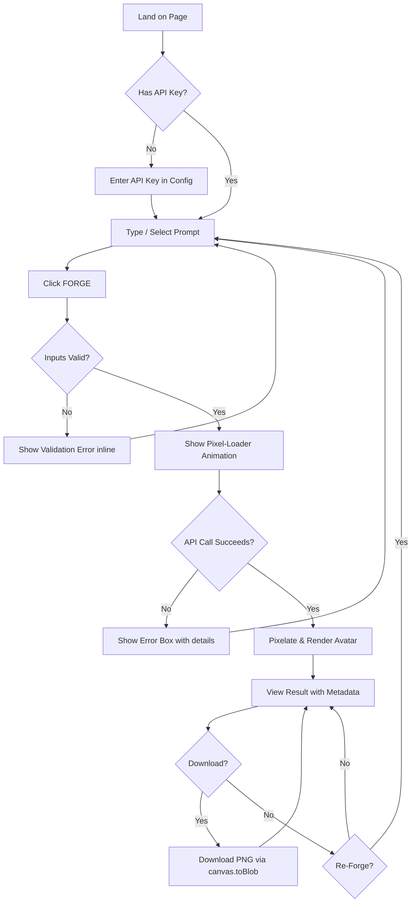

# UX Design Specification 8bit-ai

**Author:** Itobeo
**Date:** 2026-05-18

---

## Executive Summary

### Project Vision

PixelForge is a single-file web application that generates stylised 8-bit pixel avatars using text-based LLMs. Users enter their own API key, choose a character type (wizard, knight, robot, astronaut, ninja, elf), describe their character, and the LLM returns a structured pixel map rendered as a retro-styled CSS grid — all in the browser, no server required.

### Target Users

Developers, content creators, and retro-gaming enthusiasts who want quick, privacy-respecting avatar generation. Users are privacy-conscious (API key stays in browser), value pixel art aesthetics, and expect a polished retro NES-era design experience.

### Key Design Challenges

1. **Privacy-first architecture** — API key and prompts never leave the browser; no server-side component
2. **LLM reliability** — Must handle malformed JSON responses, API errors, and timeouts gracefully
3. **Retro authenticity** — NES palette, scanline effects, pixel-perfect rendering across devices

### Design Opportunities

1. **Delightful micro-interactions** — Pixel loading animations, CRT scanline effects, satisfying button clicks
2. **Zero-friction setup** — Provider presets, example prompts, saved config make first use seamless
3. **Shareable output** — Clean download flow with pixel-metadata overlay

## Core User Experience

### Defining Experience

The single most important user action is **generating a pixel avatar from a text prompt**. The core loop: enter API key → select character type → describe character → click FORGE → view result → download or re-forge. Every UI element serves this loop. The "FORGE" button is the primary call-to-action, always visible and accessible.

### Platform Strategy

Single-file web application, no build step, works by opening the HTML file directly in a modern browser (Chrome 110+, Firefox 115+, Safari 16+). Mouse/keyboard primary input. No server-side component — all processing happens client-side. localStorage for settings persistence only (theme, API config). No offline functionality required since LLM API calls need connectivity.

### Effortless Interactions

- **One-click example prompts** — 6 preset character descriptions fill the prompt field instantly
- **Provider presets** — Selecting a provider auto-fills API URL, model, and key placeholder
- **Config persistence** — API settings saved to localStorage across sessions
- **Keyboard shortcut** — Cmd/Ctrl+Enter to generate from prompt field
- **Theme toggle** — One-click dark/light switch with persistence

### Critical Success Moments

1. **The reveal** — After the pixel-loader animation, the rendered 8-bit avatar appears. This is the "aha!" moment.
2. **First successful generation** — Users validate that their API key works and the LLM produces valid pixel output.
3. **Download** — Clean PNG export with no friction confirms the output is real and usable.
4. **Error handling** — If an API call fails or the LLM returns bad JSON, the error must be human-readable and actionable.

### Experience Principles

1. **Privacy-first by design** — API key never leaves the browser; no backend, no tracking
2. **Retro authenticity** — Every pixel, every border, every font choice reinforces the NES-era feel
3. **Zero-config path to delight** — Example prompts and provider presets reduce setup friction
4. **Transparent feedback** — Every state (empty, loading, result, error) is visually distinct and informative

## Desired Emotional Response

### Primary Emotional Goals

- **Nostalgic delight** — The retro NES aesthetic (Press Start 2P font, NES colour palette, scanline overlay, pixel-loader animation) evokes fond memories of 8-bit gaming
- **Creative empowerment** — Users feel like they're forging something unique from their own imagination
- **Playful satisfaction** — The "FORGE" button, blinking pixel loader, and chip-style examples make the experience feel like a game itself
- **Privacy confidence** — Knowing their API key stays in the browser builds trust

### Emotional Journey Mapping

1. **Discovery** — Curious and intrigued by the retro aesthetic
2. **Setup** — Slight friction entering API key, mitigated by provider presets
3. **Generation (loading)** — Anticipation with the pixel-loader animation
4. **Result reveal** — Delight and surprise at the pixelated output
5. **Download** — Accomplishment and satisfaction
6. **Return visit** — Comfortable familiarity from saved config and theme persistence

### Micro-Emotions

- **Confidence** — The form validates inputs before submission; error messages are specific
- **Trust** — API key is masked, never stored server-side, visually confirmed private
- **Excitement** — The blinking pixel-loader builds anticipation
- **Satisfaction** — Clean PNG download with proper filename and pixel metadata
- **Frustration (avoided)** — By validating inputs early and providing example prompts

### Design Implications

- **Nostalgia** → Pixel-loader animation, CRT scanlines, NES palette, Press Start 2P font
- **Empowerment** → Prominent FORGE button, visible prompt field, example chips for inspiration
- **Trust** → Masked API key with show/hide toggle, "Settings saved locally" notice
- **Delight** → Button press effects (translate 2px, 2px), theme toggle, chip hover states

### Emotional Design Principles

1. **Nostalgia is the hook** — Every visual element should reward users who remember 8-bit gaming
2. **Anxiety-free setup** — The API key is the only barrier; make it feel safe and temporary
3. **Anticipation builds delight** — The loading state should feel like a retro game loading screen
4. **Output is the reward** — The pixel avatar should feel like finding a rare item in a game

## UX Pattern Analysis & Inspiration

### Inspiring Products Analysis

The PixelForge design language is directly inspired by the NES (Nintendo Entertainment System) hardware aesthetic. Key reference points include:
- **Retro game emulators** — Clean, utilitarian layout that puts the game screen front and centre
- **Pixel art tools (Aseprite/Piskel)** — Palette-focused workflows with clear tool/action separation
- **AI playgrounds (Replicate/OpenAI)** — Familiar API key input + prompt → output pattern users already know

### Transferable UX Patterns

**Navigation Patterns:**
- **Vertical single-column scroll** — Works like a retro game menu; natural mobile/desktop responsive
- **Numbered sections (01, 02, 03)** — Like game level/step indicators; gives progress structure

**Interaction Patterns:**
- **Chip-based quick actions (example prompts)** — Like selecting a weapon/character in a game
- **Show/hide key toggle** — Standard security pattern adapted with retro button styling
- **Custom `<select>` dropdown** — Matches the retro feel better than system default

**Visual Patterns:**
- **Scanline overlay** — CRT screen effect, instantly recognizable to retro fans
- **Pixel-loader animation** — Single blinking pixel block, minimal and nostalgic
- **Shadow offset (8px 8px)** — Mimics NES sprite shadow rendering

### Anti-Patterns to Avoid

- **Over-animation** — Too many moving elements breaks the retro pixel-art stillness
- **Modern glassmorphism/shadows** — Blur and transparency effects conflict with crisp pixel aesthetic
- **Loading spinners** — A retro game never used a spinner; pixel-loader is the right choice
- **Standard system form controls** — Native `<select>` and buttons break the immersive retro theme

### Design Inspiration Strategy

- **Adopt** — NES palette constraints, scanline overlay, pixel-loader animation, offset shadows
- **Adapt** — Modern responsiveness (flexbox/grid) with retro visual language; dark/light theme as two distinct NES-style palettes
- **Avoid** — Any visual element that couldn't exist on an NES (gradients, blurs, rounded corners)

## Design System Foundation

### Design System Choice

**Custom CSS Design System (CSS Custom Properties)**

Single-file HTML app with no build step demands a zero-dependency approach. The design system is defined entirely through CSS custom properties scoped to `[data-theme="dark"]` and `[data-theme="light"]` selectors.

### Rationale for Selection

- No build tooling or bundler — the design system must be inline CSS
- Retro pixel aesthetic is highly specific — no off-the-shelf system supports NES palette + scanlines + Press Start 2P typography
- Two distinct themes (dark/light) are well-served by CSS variables
- Single developer, single file — component library overhead is unnecessary

### Implementation Approach

**Design Tokens (CSS Custom Properties):**

- `--bg` — Page background
- `--surface` — Card/section background
- `--fg` — Foreground text colour
- `--muted` — Secondary/meta text colour
- `--border` — Border colour for sections and inputs
- `--accent` — Primary accent (CTA buttons, focus highlights)
- `--accent-dim` — Hover/active state for accent
- `--danger` — Error state colour
- `--success` — Success state colour
- `--scanline` — Scanline overlay colour (semi-transparent)
- `--shadow` — Drop shadow colour
- `--font-display` — Press Start 2P (retro display font)
- `--font-body` — Courier New / monospace stack

### Customization Strategy

Token values swap entirely between dark and light themes using `[data-theme="dark"]` and `[data-theme="light"]` blocks. No component-level overrides needed. The system is intentionally flat — no cascade deeper than theme → element.

## Core User Experience (Detailed)

### Defining Experience

**"Type a prompt, click FORGE, get a pixel avatar."** The core interaction is: describe a character → select a type → generate → view → download. Every UI element, state, and transition serves this single loop.

### User Mental Model

Users bring the mental model of an AI image generator (prompt → result) combined with retro game creation. They expect: (1) a text input for their idea, (2) a big action button, (3) visual feedback while waiting, (4) a downloadable result. The numbered sections (01 CONFIG, 02 PROMPT, 03 AVATAR) reinforce a step-by-step wizard mental model.

### Success Criteria

- **First-time success** — A new user can go from page load to a generated avatar in under 30 seconds (with API key ready)
- **Zero confusion** — The FORGE button is always the most visually prominent element
- **Clear feedback** — Every state (empty, loading, result, error) is visually distinct and informative
- **Instant delight** — The pixel-loader animation and reveal of the NES-palette avatar creates a "wow" moment

### UX Pattern Analysis

**Established patterns used:** Form input → button → loading → result display (standard AI playground pattern)
**Unique twist:** The FORGE metaphor, retro game loading screen aesthetic, and chip-based quick prompts make a familiar pattern feel fresh

### Experience Mechanics

1. **Initiation** — User enters API key, types a character description, optionally clicks an example chip or selects a provider
2. **Action** — User clicks "FORGE" (or presses Cmd/Ctrl+Enter). Button enters disabled state with loading animation
3. **Feedback** — The pixel-loader blinks with "GENERATING..." text. The scanline background continues. The generate button is disabled
4. **Completion** — The avatar canvas renders the pixelated result with metadata (size, palette, prompt preview). Download and Re-Forge buttons appear
5. **Error** — Error box with specific actionable message replaces viewer area

## Visual Design Foundation

### Color System

**Dark Theme (default):**
- Background `#0f0e2e` — Deep navy, like an unlit CRT screen
- Surface `#1a1a3e` — Slightly lighter navy for cards
- Accent `#fcb84c` — Warm gold, primary calls-to-action
- Border `#3a3a6e` — Muted indigo borders
- Muted `#8888aa` — Secondary/meta text
- Scanline `rgba(255,255,255,0.015)` — Subtle CRT overlay

**Light Theme:**
- Background `#f5e6c8` — Warm parchment/aged paper
- Surface `#faf0dc` — Lighter cream for cards
- Accent `#d97a3a` — Burnt orange, primary calls-to-action
- Border `#d4b896` — Warm tan borders
- Muted `#8b7355` — Brown muted text
- Scanline `rgba(0,0,0,0.025)` — Subtle overlay

Semantic tokens: `--danger` (red), `--success` (green), `--shadow` (drop shadow).

### Typography System

- **Display font:** `'Press Start 2P'` — Google Fonts, pixel-perfect monospace display face used for all headings, labels, buttons, and UI text. Uppercase by convention.
- **Body font:** `'Courier New', 'IBM Plex Mono', ui-monospace, monospace` — Monospace stack for input fields and error messages.
- **Size scale:** 9px (meta), 10px (section labels, chips), 11px (buttons), 12px (body labels), 14px (inputs), 18-28px (headings, fluid with clamp)

### Spacing & Layout Foundation

- **Container:** max 720px wide, 24px padding (16px mobile)
- **Sections:** 3px solid borders, 24px padding (16px mobile)
- **Inputs:** 12-14px padding, 2px borders
- **Buttons:** 12px padding (14px primary), 3px borders
- **Gaps:** 8px (inline elements, chips), 10px (action rows), 14px (form fields), 24px (between sections)
- **Layout:** Single-column vertical stack, flexbox/grid internal layout

### Accessibility Considerations

- Both themes maintain sufficient contrast between `--fg` and `--bg`
- Focus states use accent colour border highlighting
- `image-rendering: pixelated` ensures crisp pixel output
### Flow Optimization Principles

1. **Minimize steps to value** — The journey from config → result is 3 visible sections. No unnecessary pages or modals.
2. **Fail fast with actionable messages** — Input validation before API call; specific error messages rather than generic failures
3. **State clarity** — Every viewer state (empty, loading, result, error) is visually distinct with zero ambiguity

## User Journey Flows

### Primary Journey: Generate Avatar

### Secondary Journey: First-Time Setup

1. Open `pixelforge-avatar-generator.html` in browser
2. Select API provider from dropdown — presets auto-fill API URL, model, and key placeholder
3. Enter API key (masked input) — toggle show/hide to verify
4. Toggle theme dark/light if desired
5. Config auto-saves to localStorage on generate

### Journey Patterns

- **Validate → Execute → Render** pattern used for the primary generate action
- **Preset → Customize** pattern for provider configuration (pick a provider, fields auto-fill, then override if needed)
- **Empty → Loading → Result → Error** state machine pattern for the avatar viewer

## Component Strategy

### Design System Components

No external design system — all components are custom CSS styled inline in the single HTML file. The design system is the set of CSS custom properties (design tokens) plus the component class library.

### Custom Components

**Section Container** (`.section`)
- Purpose: Groups related content into a card-like block
- States: default only (no interactive states)
- Content: section label + any content

**Pixel Button** (`.btn`, `.btn-primary`)
- Purpose: Calls-to-action, form submission, secondary actions
- States: default, hover (accent-dim bg), active (translate 2px,2px), disabled (0.4 opacity, no-click)
- Variants: `.btn-primary` (accent bg, 14px padding), `.btn` (default, 12px padding)

**Pixel Input** (`input[type="text"]`, `input[type="password"]`, `textarea`)
- Purpose: Text entry for prompts, URLs, keys
- States: default, focus (accent border)
- Styling: 2px solid border, monospace font, 12-14px padding

**Custom Select** (`.custom-select`)
- Purpose: Provider selection dropdown styled to match retro aesthetic
- States: closed, open, option hover, option selected
- Anatomy: trigger button (shows current value + arrow) + dropdown with options list

**Example Chip** (`.example-chip`)
- Purpose: One-click prompt presets
- States: default, hover (accent border + text)
- Content: 6 fixed character types (wizard, knight, robot, astronaut, ninja, elf)

**Avatar Viewer State Machine** (`.viewer` + substates)
- States: empty (`.viewer-empty`), loading (`.viewer-loading`), result (`.viewer-result`), error (`.error-box`)
- Each state is a mutually exclusive display, switched via `hidden` class

**Pixel Loader** (`.pixel-loader`)
- Purpose: Loading animation during LLM generation
- Behavior: Single accent-coloured square blinking at 0.6s step-end interval

**Action Row** (`.action-row`, `.api-row`, `.generate-row`, `.examples-row`)
- Purpose: Flexbox layout helpers for inline action groups
- Mobile: Stacks vertically at ≤600px

### Implementation Roadmap

Single-phase implementation — all components are already defined in the reference HTML. No phased rollout needed for a single-file app.

## UX Consistency Patterns

### Button Hierarchy

- **Primary action** (`.btn-primary`): One per view — "FORGE" (generate), "DOWNLOAD PNG" (save). Accent background, larger padding.
- **Secondary actions** (`.btn`): "SHOW/HIDE" (key toggle), "RE-FORGE" (regenerate), theme toggle. Default background, smaller.
- **Disabled state**: `.btn-primary:disabled` with 0.4 opacity, no-pointer, no active transform.

### Feedback Patterns

- **Empty state**: Large pixel icon + instructional text ("ENTER A PROMPT & FORGE YOUR PIXEL")
- **Loading state**: Blinking pixel square + "GENERATING..." text (step-end animation)
- **Success state**: Avatar canvas render with metadata (size, palette, prompt preview)
- **Error state**: Red-bordered box with specific, human-readable error message
- **Hover states**: Border colour shift to accent on all interactive elements

### Form Patterns

- **Validation**: All fields checked on submit (not on keystroke). Missing/invalid fields show specific error messages.
- **API key input**: `type="password"` with show/hide toggle. Never saved to localStorage.
- **Provider select**: Custom styled dropdown with 3 presets that auto-fill URL + model fields.
- **Auto-save**: Config saved to localStorage on successful generate, restored on page load.

### Navigation Patterns

- **Vertical single-column scroll** — No multi-page nav. All sections visible via scroll.
- **Section numbering** (01 CONFIG, 02 PROMPT, 03 AVATAR) — Acts as progress indicator.
- **Theme toggle** — Persistent in header, always accessible.

## Responsive Design & Accessibility

### Responsive Strategy

Single-column layout adapts naturally without complex media queries. Priority is readability and touch targets on smaller screens, maintaining the retro aesthetic across all sizes.

### Breakpoint Strategy

- **Default (desktop ≥ 601px):** Horizontal action rows, 24px container padding, 24px section padding
- **Tablet/mobile (≤ 600px):** 16px container padding, 16px section padding, action rows stack vertically, viewer min-height reduces to 240px
- **Small mobile (≤ 360px):** 8px section padding, tighter chip text/padding, minimal spacing

### Accessibility Strategy

**Target: WCAG Level A**

- **Colour contrast:** Both themes maintain sufficient foreground/background contrast (`--fg` on `--bg`)
- **Focus indicators:** Accent-coloured border on `:focus` for all inputs and buttons
- **Keyboard navigation:** Cmd/Ctrl+Enter shortcut for generate; all buttons focusable and activatable
- **Touch targets:** Minimum 44px height on all buttons and interactive elements
- **Screen readers:** Semantic HTML structure (`<header>`, `<button>`, `<label>`, `<canvas>`)

### Testing Strategy

- Open `pixelforge-avatar-generator.html` directly in Chrome, Firefox, Safari
- Test all 4 viewer states (empty, loading, result, error)
- Test dark/light theme toggle and persistence
- Test responsive behaviour at 600px and 360px breakpoints
- Test with keyboard-only navigation (Tab through all controls)
- Test API error scenarios (invalid key, timeout, malformed response)

### Implementation Guidelines

- Use relative units (`clamp()` for font sizes, `%`/`vw` for container widths)
- Maintain `image-rendering: pixelated` on all canvas/pixel elements
- Keep the single-file architecture — no external dependencies beyond Google Fonts
- Preserve the `data-theme` pattern for dark/light switching
- Use CSS custom properties for all design tokens to enable easy theming
- Font sizes use `clamp()` for fluid scaling

## Design Direction Decision

### Design Direction: Authentic 8-Bit Retro (Single Direction)

The reference HTML fully specifies the design direction — no alternative visual directions needed. The aesthetic is rooted in NES-era gaming hardware with modern usability patterns layered on top.

### Key Elements

- **NES colour palette** — 64-colour well-known approximation, applied via closest-colour quantization
- **CRT scanline overlay** — Repeating linear gradient on body background
- **Press Start 2P** — Pixel-perfect Google Font for all UI text
- **Offset box shadow** — 8px 8px shadow mimicking NES sprite rendering
- **3px solid borders** — Thick, crisp borders on all sections and buttons
- **Section numbering (01, 02, 03)** — Game-like level indicator naming
- **Custom select dropdown** — Styled to match retro aesthetic, replacing system default

### Rationale

The retro NES aesthetic directly supports the product's purpose (generating 8-bit pixel avatars). Visual authenticity creates alignment between the tool's interface and its output — the page itself feels like it could be a retro game screen.
